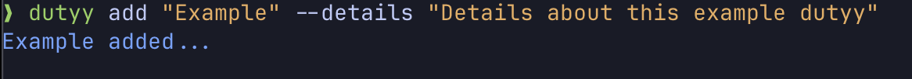
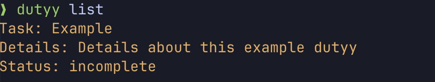
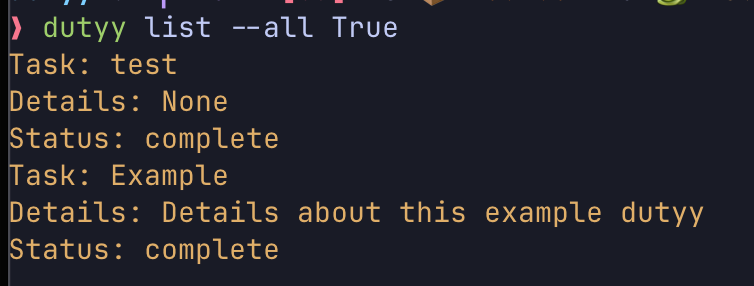
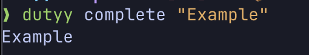

# Dutyy

A lightweight cli to-do app powered by click

## Install

UV is required for install [more about uv here](https://docs.astral.sh/uv/)

UV Install

```bash
uv tool install git+https://github.com/Oatmeal4Breakfast/dutyy.git
```

## Use

When first installed run the following command.

```bash
dutyy init
```

This will initialize the sqlite database where ever UV installs tools on your OS under the name 'database.db'.

## Commands

| Command  | Options  | Explanation                                                                  |
| -------- | -------- | ---------------------------------------------------------------------------- |
| add      | --detail | _Defaults to null_ string value to store infomration about the dutyy.        |
| list     | --all    | _Defaults to False._ Toggles the filter to show all or just incomplete tasks |
| complete | \        | marks the task as complete                                                   |

### Examples

Adding a dutyy with the optional detail flag

```bash
dutyy add "Example" --detail "Details about this example dutyy"
```



Listing only incomplete dutyy

```bash
dutyy list
```



Listing all dutyy

```bash
dutyy list --all
```



Marking dutyy as complete

```bash
dutyy complete "Example"
```



## Road Map

- [ ] Add support to mark dutyy as complete by passing ID
